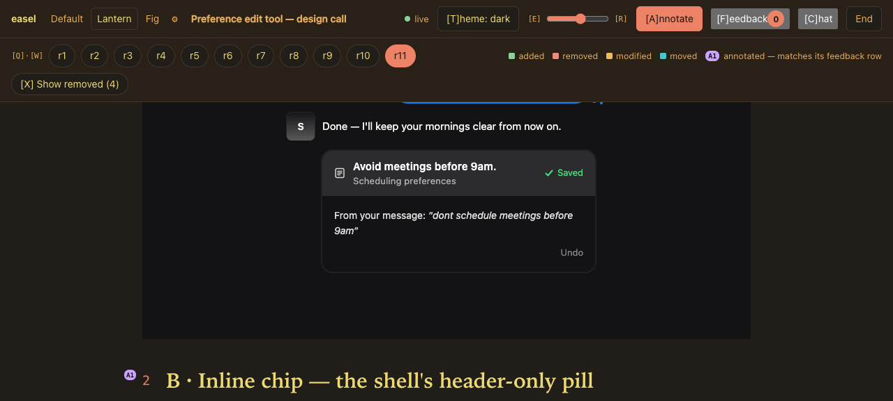
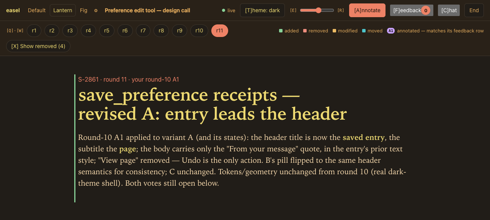
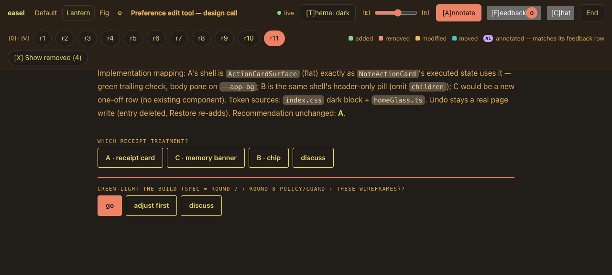
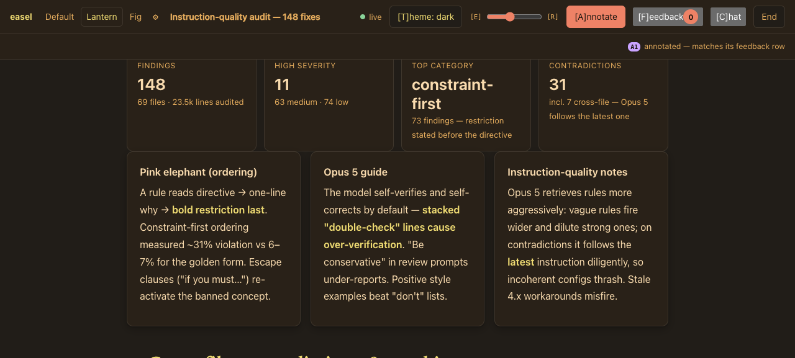
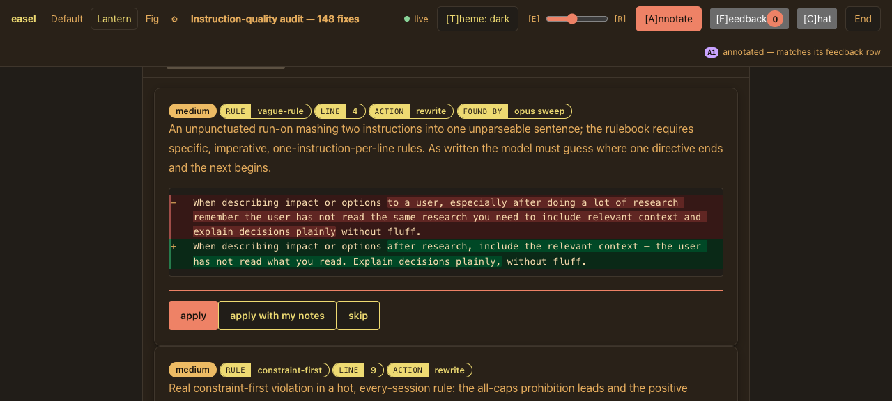
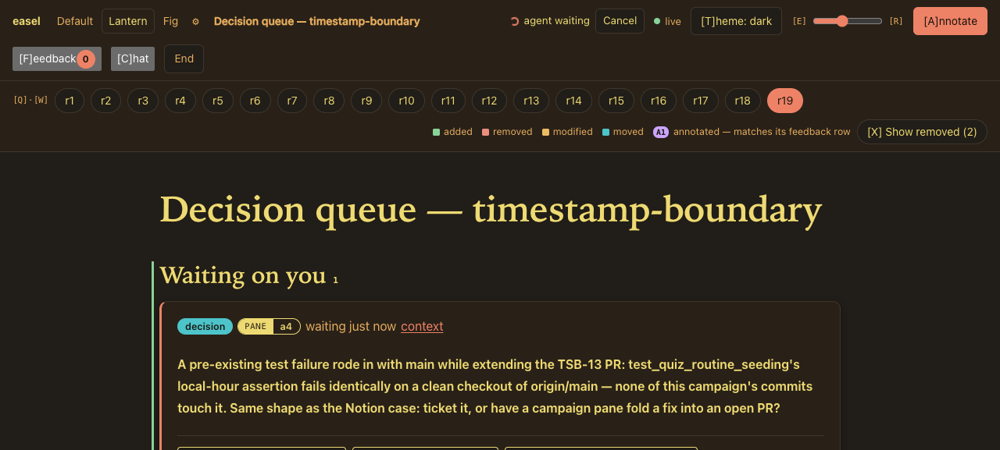
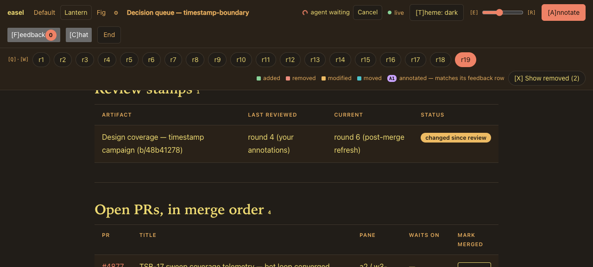

# easel in use

Screenshots of real boards from a few weeks of multi-agent work. Three workflows: a UI design that took eleven rounds to settle, a 148-finding audit reviewed with per-finding verdict buttons, and a campaign queue that collected decisions across nineteen rounds. Lantern theme, dark.

## Design iteration

A product designer would use Figma for this. An agent uses a board. Each design variant renders inside an **island** — a sandboxed frame with its own CSS, so the mockup is built from the product's real components and tokens, not an approximation:

The purple chip next to the variant heading is an annotation from an earlier round. Feedback lands on the element it was made on, and the chip label ("A1") is how both sides refer to it afterwards.

This board took eleven rounds. The tabs at the top are the whole history — every round is kept, and any two can be compared:

The ask at the bottom of the board is concrete: which treatment ships, and is the build green-lit. Options are buttons; a click is queued and delivered with the rest of the feedback in one batch:

## Evals and audits

An audit produced 148 findings across 69 files. Nobody reads 148 findings in a terminal. On a board, the summary is a row of stat tiles and the method fits in three cards:

Each finding is a card: severity and category as badges, the reasoning as prose, the proposed rewrite as a word-level diff, and a verdict row — **apply / apply with my notes / skip**. The reviewer works through them like an inbox, and the agent gets back a per-finding verdict list instead of a vague "looks good":

The same pattern carries blind A/B comparisons, golden-answer reviews, and model-output grading — anywhere the human's job is many small judgments rather than one big one.

## The campaign queue

When several agents work in parallel, their questions pile up in chat and get lost. The queue template gives a campaign one page that always answers "what's waiting on me." Agents file questions; the human answers on the page; the answer routes back to the pane that asked. This one ran for nineteen rounds:

Below the open asks, the board tracks what the human has already reviewed — and whether it changed since — plus the campaign's open PRs in merge order:

## The mechanics under all of this

Every board above works the same way:

- **Anything on the page is annotatable** — a sentence, a table cell, a badge, a point inside a design island. Click Annotate, click the thing, type. Comments queue as drafts and deliver as one batch on Send.
- **An agent is blocked waiting** on each of these boards (`easel await`, top right: *agent waiting*). Send unblocks it with the batch, anchored to the elements it was made on.
- **Rounds are diffs.** A republished board marks what was added, removed, modified, or moved since the round the human last saw, and removed text can be shown struck through in place.
- **The daemon owns the state.** Boards outlive sessions and agents — the design call above spanned days and multiple agent handoffs, and the queue collected answers for a whole campaign.

The flow, from the agent's side: `easel open` → `easel await` → apply the feedback → `easel publish` → await again. Details in [usage.md](usage.md); per-template authoring guides in [templates/](templates/).
