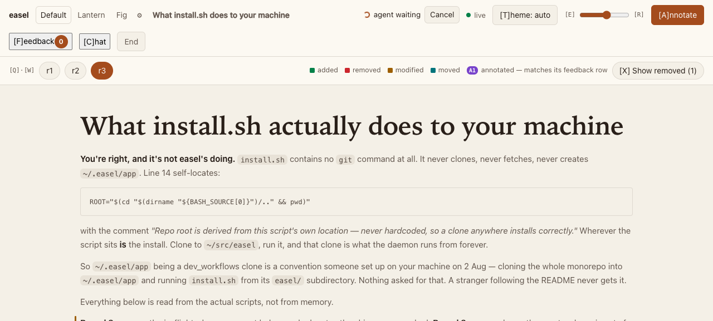
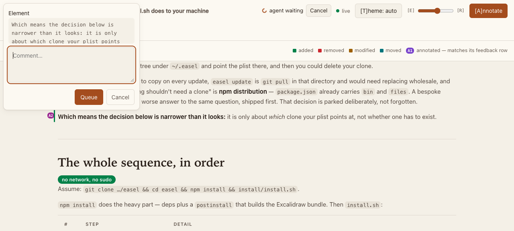
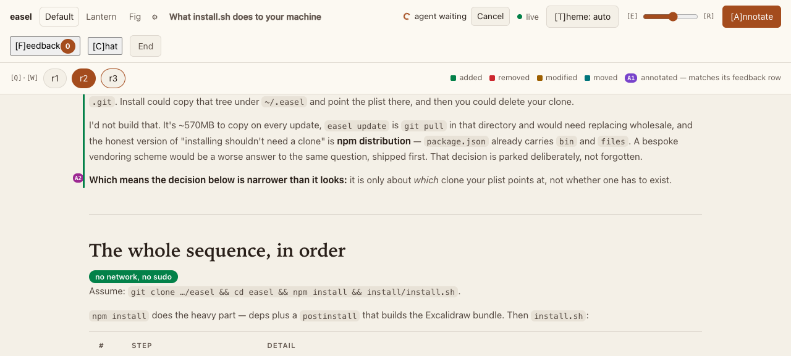
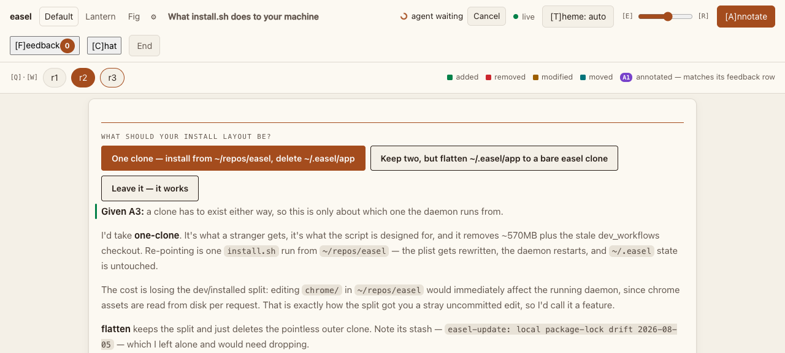
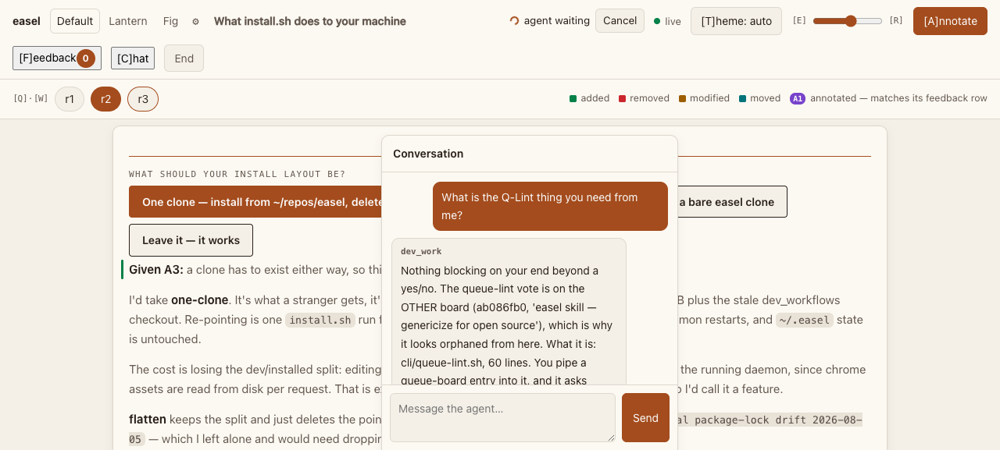
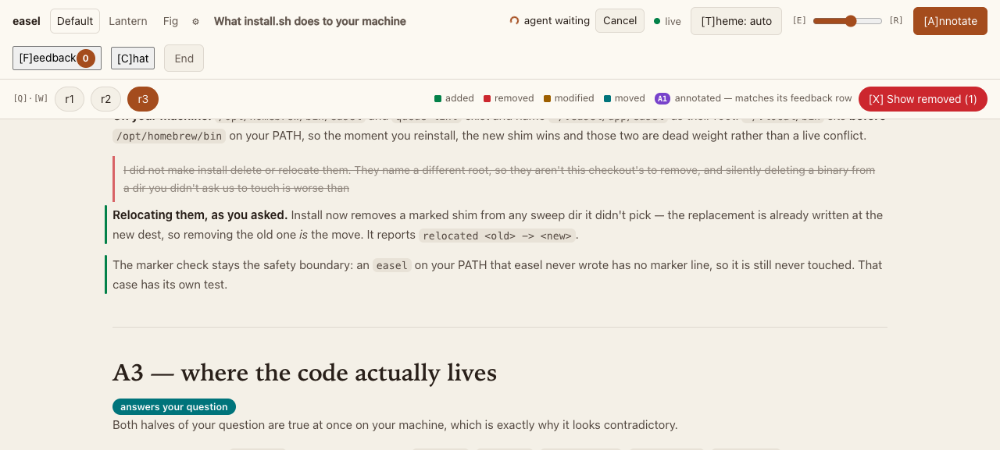
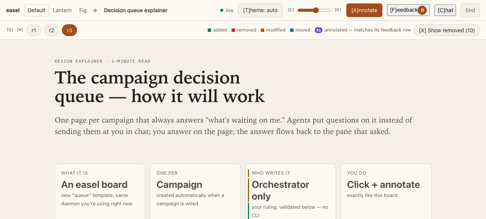
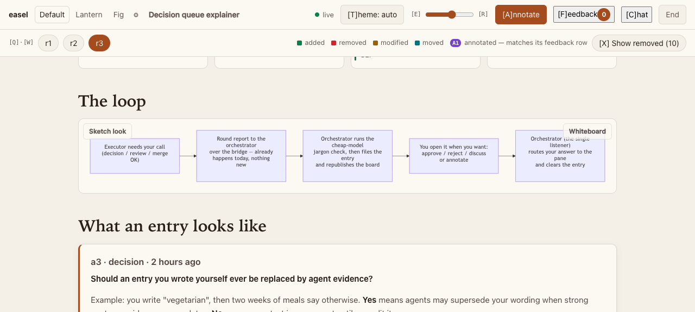

# easel in pictures

Real boards from a real session — the day easel's own installer was reviewed on an easel board. The agent published its findings, the human annotated them, the agent applied the feedback and republished, and the board carried the whole exchange. No mockups; this is what the loop looks like in use.

## A published board

A `review`-template board: title, summary, sections with badges, tables — rendered from a JSON data file the agent wrote. The top chrome carries the theme pickers, the round tabs (`r1 r2 r3`), and the diff legend. Note **agent waiting** on the right: an `easel await` is parked on this board, blocked until the human sends feedback.



## Annotating

Click **Annotate**, then click anything on the page — a sentence, a table cell, a badge. The composer quotes the exact element and queues the comment as a draft; **Send** delivers the whole batch to the waiting agent at once, as JSON, each item anchored to the element it was made on.



Once sent, each annotation leaves a numbered chip in the margin (**A2** here). The chip is the shared name for that piece of feedback — the agent's reply says "your A2", and both sides mean the same thing. The green bars on the left are diff markers: this text is new in this round.



What the parked `easel await` receives when Send is clicked — real output from this board:

```json
{
  "items": [
    {
      "id": 1791,
      "kind": "annotation",
      "excerpt": "First writable of /opt/homebrew/bin, /usr/local/bin, ~/.local/bin",
      "context": { "heading": "The whole sequence, in order" },
      "comment": "We're not installing this via homebrew. We obviously should not use homebrew as one of the dirs."
    },
    {
      "id": 1816,
      "kind": "widget",
      "widgetId": "install-layout",
      "value": "one-clone"
    }
  ],
  "upto": 1816
}
```

## Decisions and votes

A board can carry structured asks, not just prose. Decision widgets render the options the agent needs answered; a click is queued and delivered with the same Send. Here the human picked **one-clone** — and the agent, woken by its await, executed exactly that.



## Chat

Questions that don't anchor to any element ride the same stream. The agent answers with `easel reply`, and the bubble carries its callsign — useful when several agents share a board.



## Rounds and diffs

The agent applies the feedback and republishes to the same key. The new round arrives with diff markers against the previous one — added, removed, modified, moved — so the human reviews *what changed since they last looked*, not the whole document again. **Show removed** reveals deleted text struck through in place. Here, round 2's "I did not make install delete or relocate them" was replaced in round 3 by "Relocating them, as you asked" — the annotation above, applied.



## The page template

For content that isn't a review or an eval, the `page` template takes hand-authored HTML through the same chrome, annotation layer, and design system — cards, metrics, badges, callouts.



Mermaid fences in any board render to inline SVG at publish time — no client-side renderer. Diagrams get a **Sketch look** toggle and open in an Excalidraw **Whiteboard** for freehand markup.



## The loop, end to end

Everything above is one cycle of the core exchange:

1. Agent: `easel open --template review --data plan.json --title "..."` → board URL
2. Agent: `easel await <key> --agent my-project:claude` → blocks
3. Human: opens the URL, annotates, clicks widgets, hits **Send**
4. The await returns the batch as JSON; the agent applies it, edits the data file
5. Agent: `easel publish <key> --note "round 2: ..."` → same URL, diff markers
6. Repeat until the human stops finding things to annotate

The daemon owns the state, so the board outlives the session, survives restarts, and can be handed to a different agent mid-review — the exchange in these screenshots spanned three sessions.
